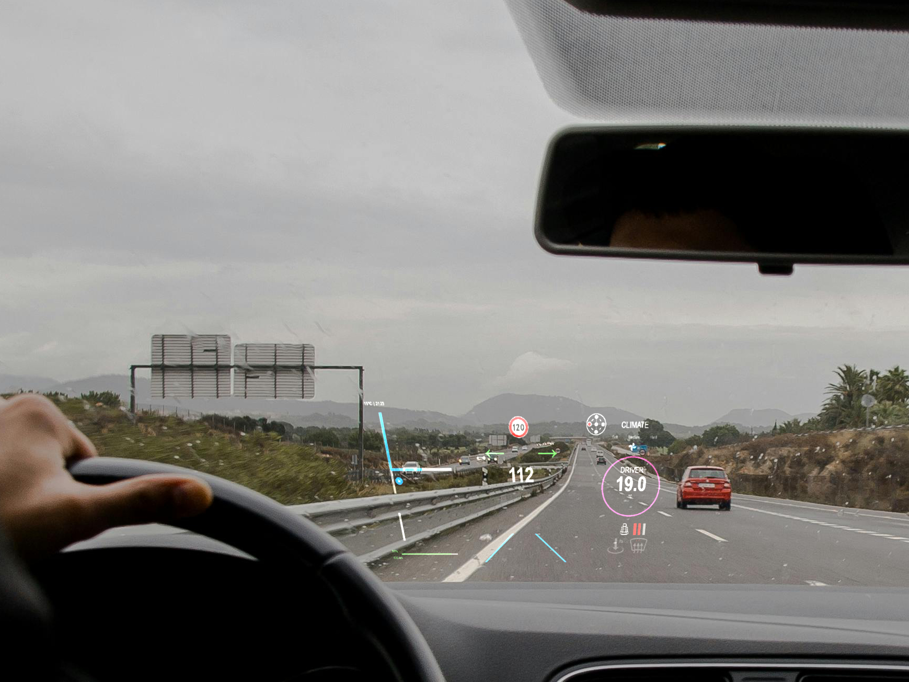
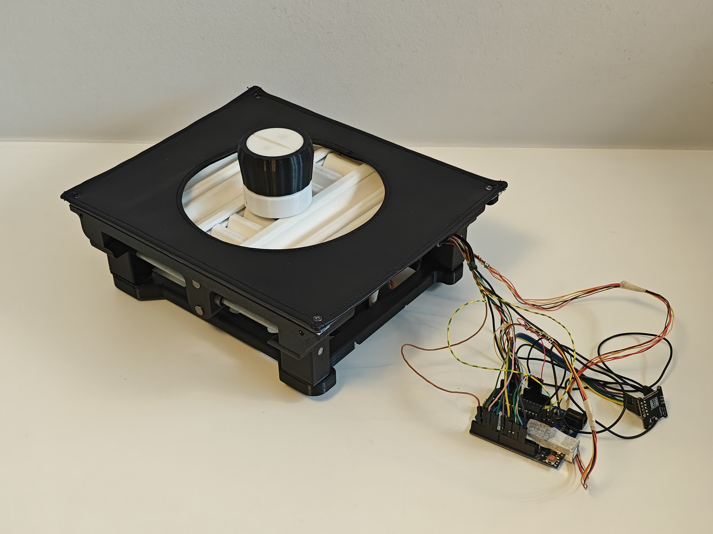
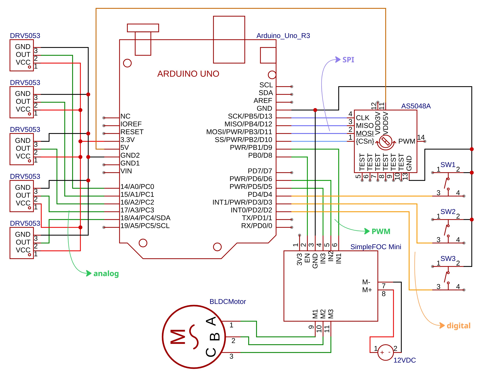
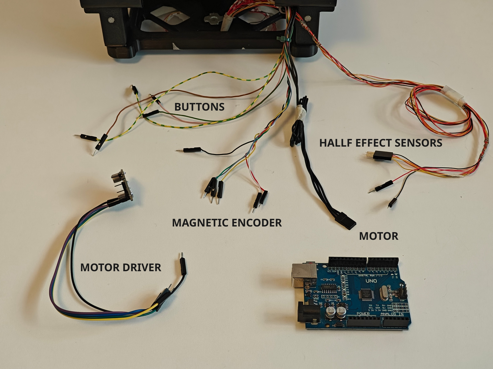
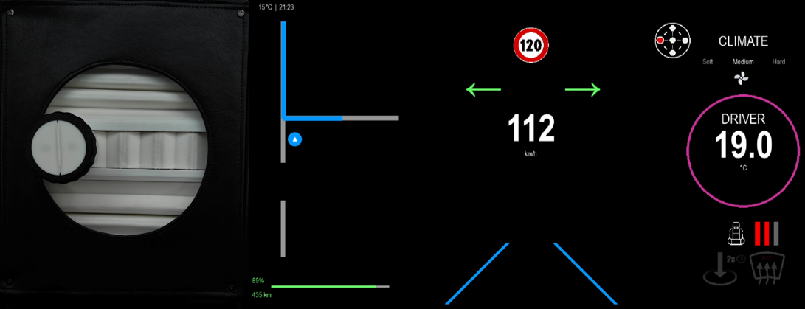
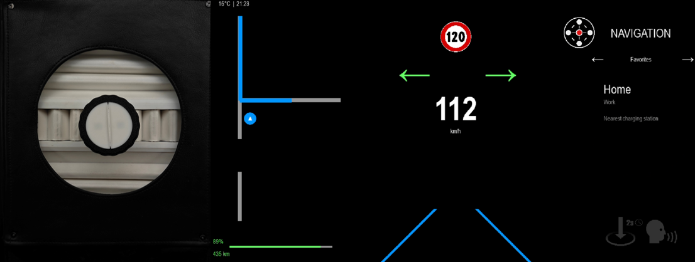
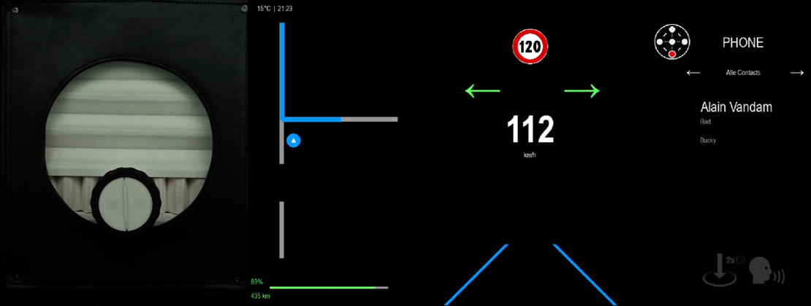
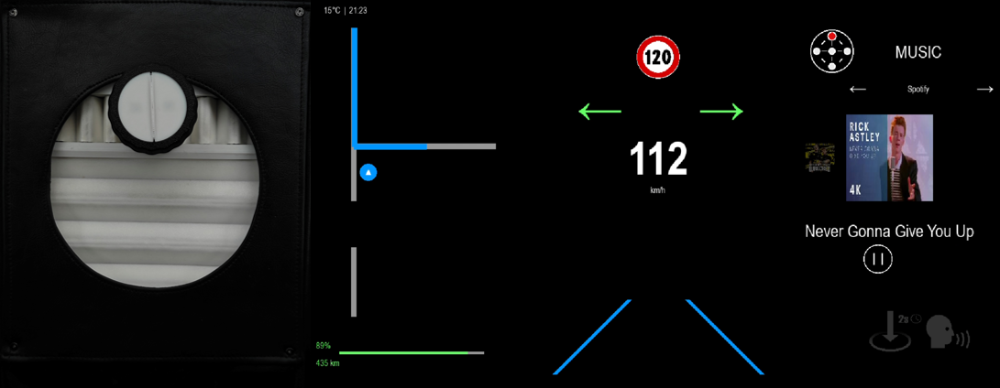

# Ctrl-Wheely
*An innovative interface that elevates safety in modern vehicles to a higher level.* 

*Projectteam: Korneel Verraes; Warre Robbe; Seppe Nijs; Bram Tops*

19/01/2026

## Introduction
In contemporary cars, large touchscreens force drivers to take their eyes off the road, even for simple actions. This conflicts with the need for focus and safety while driving. Ctrl-Wheely originates from this tension and rethinks vehicle control more naturally. The system combines a modular rotary controller with targeted haptic feedback, allowing functions to feel intuitive and to be operated by touch rather than sight.

Essential information such as climate and media settings is displayed on a head-up display directly within the driver’s field of view. Through a carefully considered mechanical design, Ctrl-Wheely creates a robust physical interaction that feels faster, causes less distraction, and restores balance to the driving experience.

<div style="display:flex; gap:20px;">
  
  
  
</div>

## Embodiment

The product architecture consists of two main assemblies. All design files are located in the `CAD-Files` folder. Use `ASSY_V6.prt` or `ASSY_V6.stp` for the full assembly of the entire system, while `ASSY V5.prt` contains the standalone dial assembly.

**The dial** serves as a smart rotary knob inspired by [Scott Bezz's SmartKnob project](https://github.com/scottbez1/smartknob). Its primary functions include rotation with programmable haptic feedback, a central short or long press, and dedicated left and right clicking actions. The design is focused on ergonomic and intuitive use.

**The gantry system** is inspired by 3D printer mechanics and utilizes a central hub on which the dial is mounted, supported by two axes. This allows the controller to move physically within the console to navigate different menus or settings. To protect the internal mechanism from dust or debris, a dual cover system has been implemented. These covers must be printed in TPU (the softer the better for flexibility), while all other structural parts can be printed in PETG or ASA for better heat resistance in automotive environments.

<div style="display:flex; gap:20px;">
  
  
  
</div>

### Bill of Materials (BOM)
#### Mechanical components:
- 2 x Smooth steel rod (Ø6 x 217.5mm)
- 2 x Smooth steel rod (Ø8 x 190mm)
- 2 x LM8UU linear ball bearing
- 2 x LM6UU linear ball bearing
- 5 x Connecting screws & sleeves (for snapping positions)
- 1 x Neodymium magnet (Ø6 x 16mm)
- 6 x Threaded rod (Ø3 x 205mm)
- 4 x Threaded rod (Ø1 x 205mm)

#### Fasteners (dial):
- 2 x M3 x 8
- 4 x M2.5 x 16
- 4 x M2.5 x 6
- 4 x M2.5 x 10 (included in the motor kit)

#### Fasteners (gantry):
- 4 x M3 x 16
- 2 x M3 x 8
- 4 x M3 x 10
- 4 x M2 x 6

The prototype has been specifically engineered to fit the interior geometry of an **Audi Q4 e-tron**.

## Hardware

The system uses an Arduino Uno to bridge the gap between physical movement and digital feedback. All components are wired according to the electrical scheme and physical setup shown below.

### Components

- 1 x Arduino Uno  
- 1 x iPower GM3506 Gimbal Motor with Encoder  
- 1 x SimpleFOC Mini motor driver  
- 5 x DRV5053 Analog-Bipolar Hall Effect Sensors  
- 2 x Small push button (6 mm)  
- 1 x Large push button (12 mm)  
- 1 x DC power supply (8-30 V)  
- 1 x Circular prototyping board (diameter 43 mm)  

### Electrical Diagram and Hardware Setup

<div style="display:flex; gap:20px;">
  
  
</div>

 

| **Component** | **Connection** |
|------------------------|----------------|
| **Motor driver** | **Arduino UNO** |
| EN (purple) | D8 |
| IN3 (blue) | D5 |
| IN2 (green) | D6 |
| IN1 (yellow) | D9 |
| GND (black) | GND |
| | |
| **Magnetic encoder** | **Arduino UNO** |
| GND (white) | GND |
| VDD (red) | +5V |
| MISO (green) | D12 |
| MOSI (yellow) | D11 |
| SCL (purple) | D13 |
| CS (black) | D10 |
| | |
| **Hall effect sensors** | **Arduino UNO** |
| VCC | +3.3V |
| GND | GND |
| OUT x 5 | A0 - A4 |
| | |
| **Push button (press)** | **Arduino UNO** |
| OUT (brown) | D2 |
| GND (yellow-green) | GND |
| | |
| **Push button (left / right)** | **Arduino UNO** |
| OUT left (green) | D3 |
| OUT right (pink) | D4 |
| GND (yellow-green) | GND |
| | |
| **Motor phase cables** | **Motor driver** |
| A (black) | M1 |
| B (black) | M2 |
| C (black) | M3 |


## Software
### Arduino

The Arduino serves as the core controller, managing all hardware interactions and real-time feedback loops. The complete implementation, found in `Ctrl-Wheely.ino`, leverages the [SimpleFOC library](https://simplefoc.com/) to drive the gimbal motor. This allows for high-precision haptic feedback that changes dynamically based on the active function and user input.

Before running the main Arduino code, the correct physical positions of the hall effect sensors must be determined. This is done using the calibration sketch `Magnet_pos_test.ino`. This sketch allows you to read and verify the sensor outputs while moving the magnet position.

The motor driver voltage must be set according to the external power supply used in the setup. Make sure to update the voltage value in the Arduino code to match your power supply.

```cpp
driver.voltage_power_supply = 11,2;
```


### PyGame
The project includes a Head-Up Display (HUD) that projects information onto the windshield, indicating which function is currently being controlled via the dial. In a previous iteration of the project, the HUD was developed using ProtoPie and connected to an Arduino. Due to the limitations of ProtoPie, all scenes are now fully implemented in Python using the PyGame library.

The user interface that was designed and tested within the course User-Centered Design has been recreated almost one-to-one in PyGame. This approach ensures that the validated and positively received UX is preserved in the final implementation. The system is not a simulated “Wizard of Oz” interface, but a fully functional and directly responsive HUD that accurately reflects the user’s interactions with the dial.

Within PyGame, it is possible to receive serial data directly from the Arduino, to which the dial is connected. This incoming serial input is used to dynamically update elements of the HUD in real time. The PyGame implementation was further extended with additional functionalities, including: Extra buttons, Submenus, Variable values per passenger or driver and Additional configurable interface elements

The full PyGame implementation of the HUD can be found in `UI_HUD_pygame.py`. 

Make sure to set the correct COM port on **line 55**.

```py
ser = serial.Serial('COM5', 115200, timeout=0)
```

For HUD usage, uncomment **lines 1027 and 1028** to mirror the screen over the x-axis. In this project Superdesk was used to project the HUD on a phone or tablet for projecting the HUD in the window of a car.

```py
#canvas = pygame.transform.flip(screen, False, True)
#screen.blit(canvas, (0,0))
```

<div style="display:flex; gap:20px;">
  
  
</div>

<div style="display:flex; gap:20px;">
  
  
  
</div>

